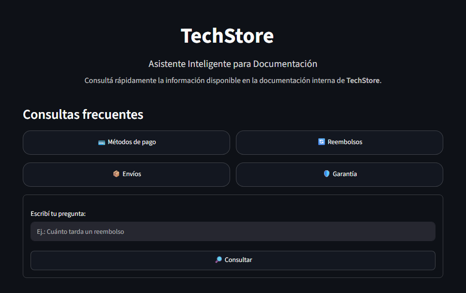
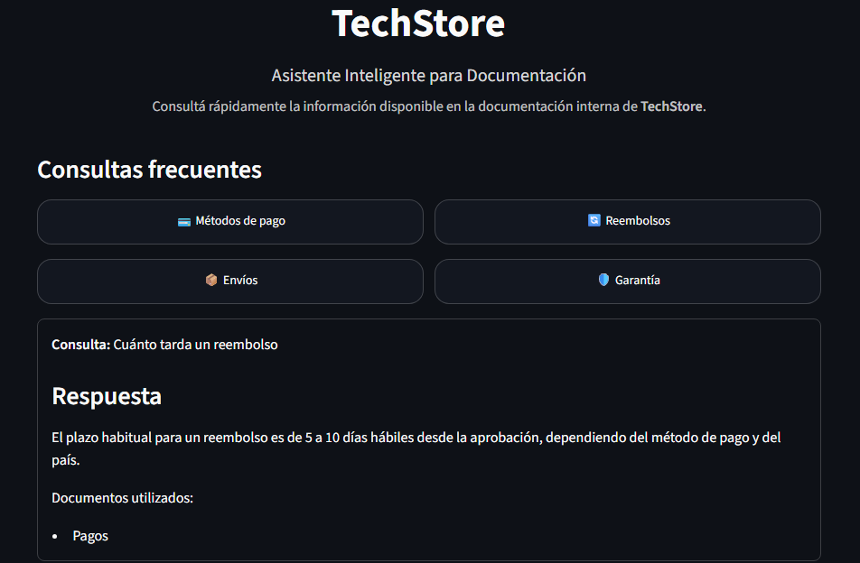

# TechStore RAG

Asistente inteligente desarrollado para el Challenge Alura Agentes 2026.

El proyecto implementa una arquitectura **RAG (Retrieval-Augmented Generation)** para responder consultas utilizando exclusivamente la documentación interna de una empresa ficticia llamada **TechStore**.

La aplicación permite realizar preguntas sobre políticas, pagos, envíos, garantías y devoluciones, recuperando primero la información más relevante desde una base vectorial y utilizando posteriormente Gemini para generar una respuesta basada únicamente en ese contexto.

## Objetivo

Desarrollar un asistente capaz de:

- Consultar documentación interna en lenguaje natural.
- Recuperar automáticamente los fragmentos más relevantes.
- Generar respuestas fundamentadas únicamente en la documentación disponible.
- Evitar respuestas inventadas cuando la información no existe.

## Estado del proyecto

Proyecto finalizado. Desplegado y listo para su uso.

## Características

- Lectura automática de documentos PDF.
- División de documentos en fragmentos (chunking).
- Búsqueda semántica mediante una base vectorial (ChromaDB).
- Generación de respuestas utilizando Gemini.
- Respuestas basadas únicamente en la documentación disponible.
- Interfaz web desarrollada con Streamlit.

## Arquitectura

El proyecto sigue una arquitectura RAG (Retrieval-Augmented Generation):

1. El usuario realiza una consulta desde la interfaz web.
2. El Retriever busca los fragmentos más relevantes en ChromaDB.
3. Los documentos recuperados se utilizan como contexto.
4. Gemini genera una respuesta basada exclusivamente en dicho contexto.
5. La respuesta se muestra junto con los documentos utilizados como referencia.

```text
Usuario
   │
   ▼
Interfaz Streamlit
   │
   ▼
Retriever
   │
   ▼
ChromaDB
   │
   ▼
Google Gemini
   │
   ▼
Respuesta
```

## Estructura del proyecto

```
techstore-rag-agent/
│
├── assets/
├── data/
├── src/
│   ├── chunking/
│   ├── loaders/
│   ├── models/
│   ├── processors/
│   ├── rag/
│   ├── services/
│   └── vectorstore/
├── streamlit_app.py
├── index_documents.py
├── requirements.txt
└── README.md
```

## Tecnologías utilizadas

- Python 3.11
- Streamlit
- LangChain
- ChromaDB
- Sentence Transformers
- Google Gemini API
- python-dotenv

## Instalación

1. Clonar el repositorio.

```bash
git clone https://github.com/AleVaz70/techstore-rag-agent.git
```

2. Ingresar al proyecto.

```bash
cd techstore-rag-agent
```

3. Crear un entorno virtual.

```bash
python -m venv .venv
```

4. Activar el entorno virtual.

**Windows**

```bash
.venv\Scripts\activate
```

5. Instalar las dependencias.

```bash
pip install -r requirements.txt
```

6. Crear un archivo `.env` con la clave de Gemini.

```text
GEMINI_API_KEY=tu_api_key
```

## Ejecución

Una vez instaladas las dependencias y configurada la API Key, iniciar la aplicación con:

```bash
streamlit run streamlit_app.py
```

Luego abrir el navegador en la dirección indicada por Streamlit (generalmente http://localhost:8501).

## Ejemplos de consultas

- ¿Qué métodos de pago acepta TechStore?
- ¿Cuánto tarda un reembolso?
- ¿Cómo funcionan los envíos?
- ¿Cómo funciona la garantía?
- ¿Qué productos no pueden devolverse?

## Capturas de pantalla

### Pantalla principal



### Ejemplo de consulta y respuesta



## Aplicación desplegada

La aplicación está disponible públicamente en Streamlit Cloud:

https://techstore-rag-vbywcz38vk5a4t6f4mmadr.streamlit.app/

## Autor

Proyecto desarrollado por **Alejandra Vazquez** para el **Challenge Alura Agentes 2026**.